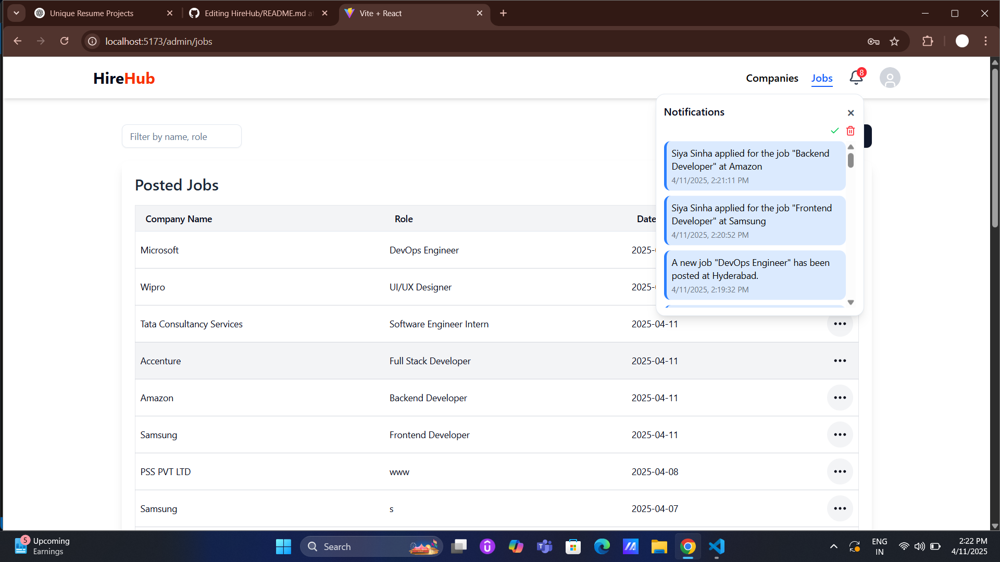
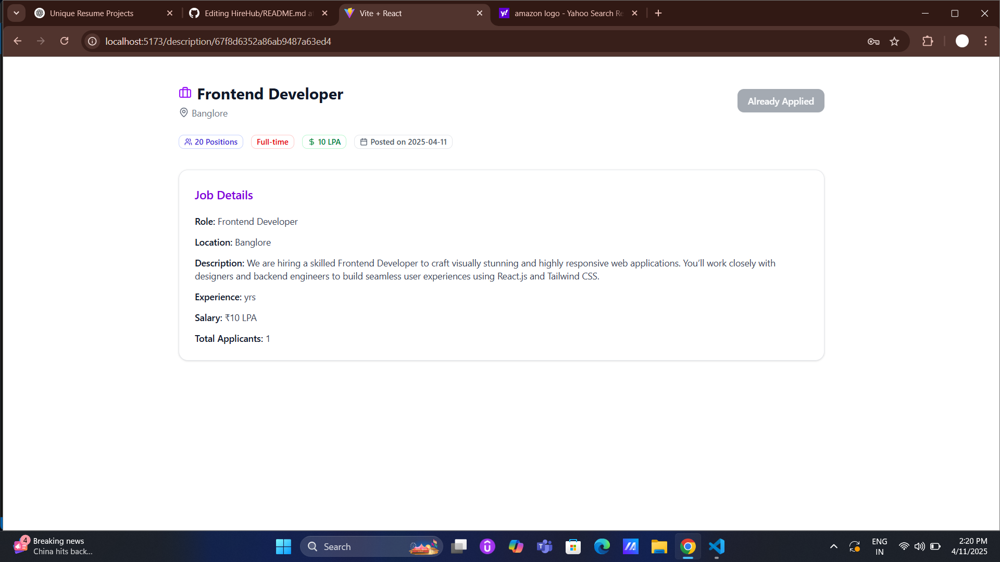
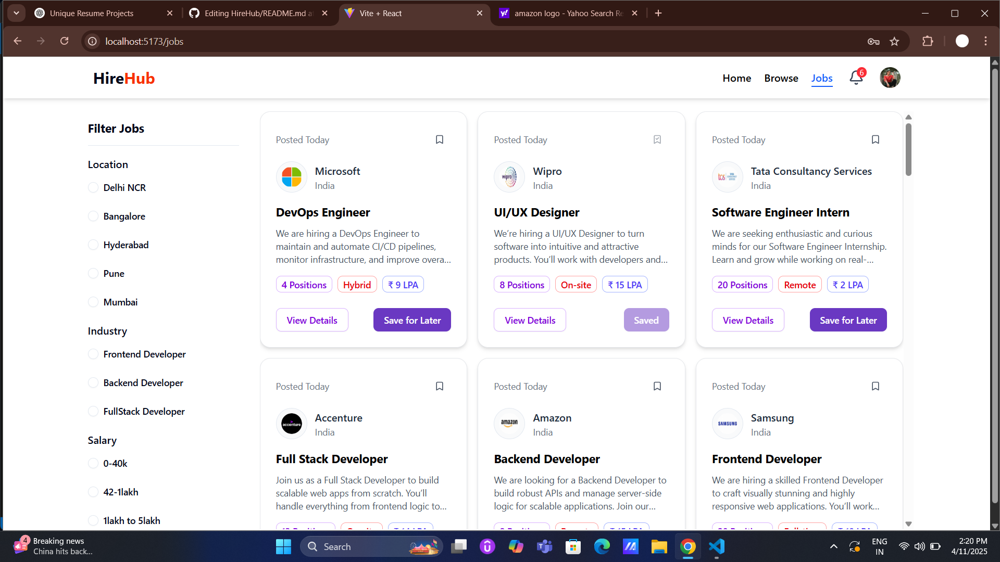
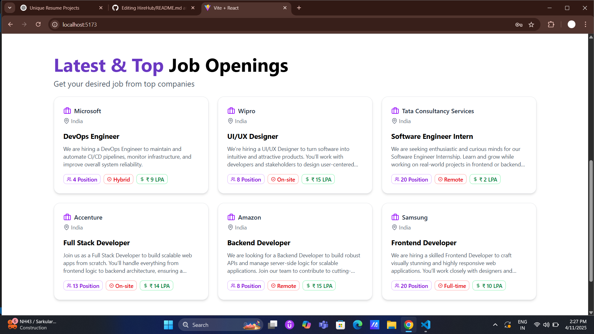
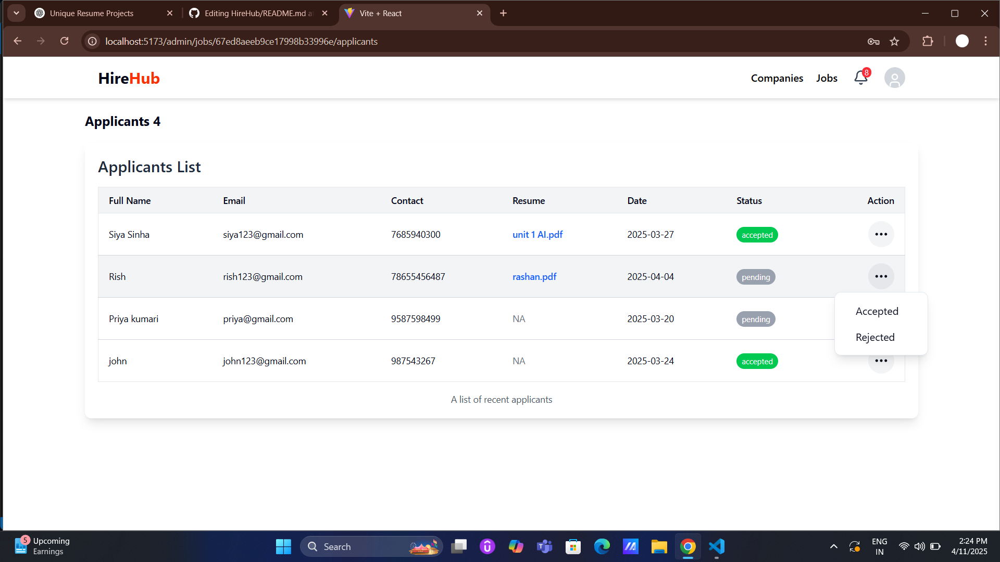
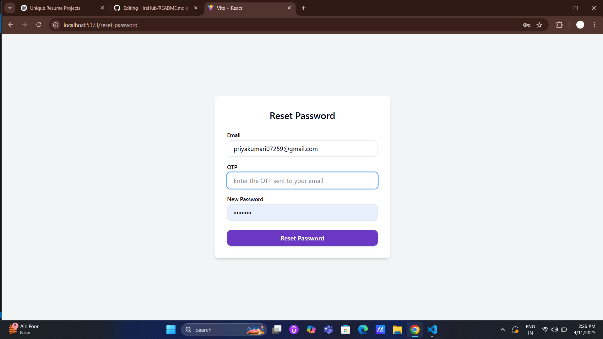
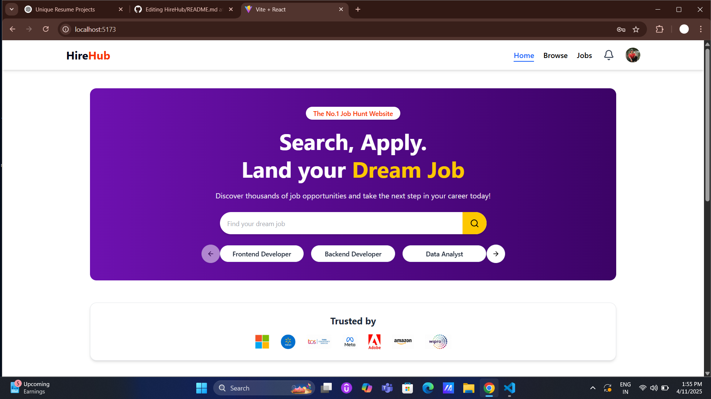
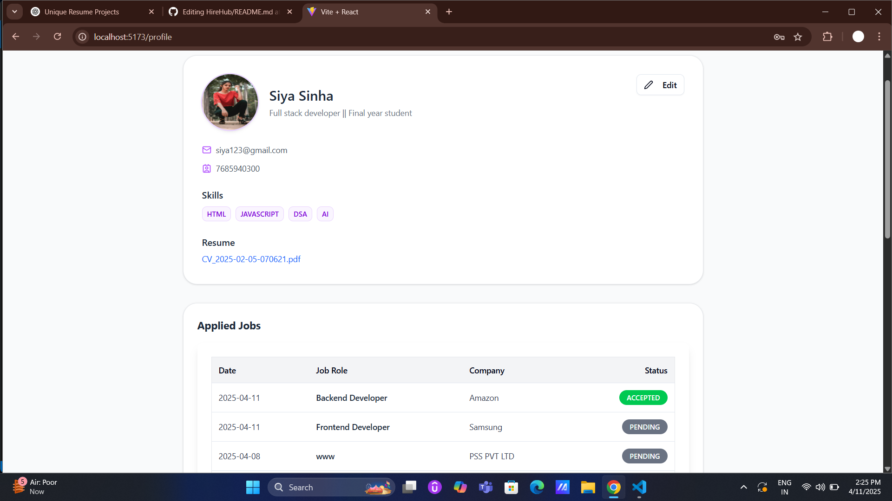
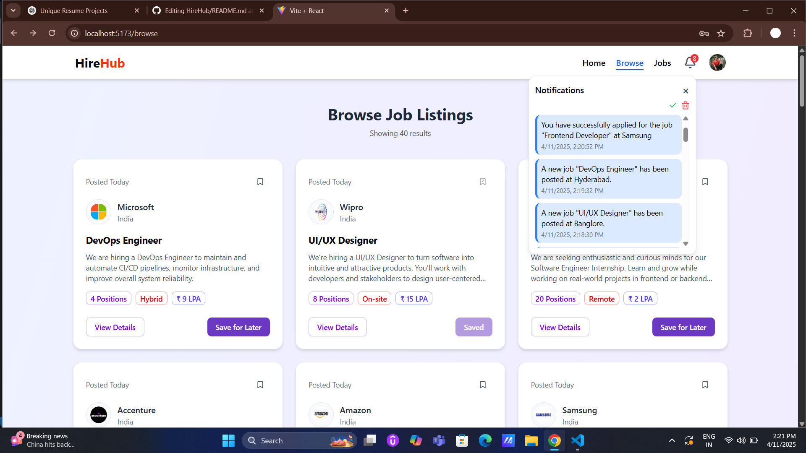

# React + Vite
# 💼 Job Portal Web Application

This is a full-stack Job Portal that connects job seekers and recruiters. It features role-based login, resume uploads, real-time notifications

---
## 🚀 Features

- **Role-Based Access**: Supports Job Seeker and Recruiter accounts.
- **Secure Authentication**: JWT-based login & registration with Bcrypt password hashing.
- **Resume Uploads**: Upload PDFs to Cloudinary.
- **Real-Time Notifications**: Stay updated with Socket.IO.

---

## 🧰 Tech Stack

| Tech               | Usage              |
|-----------------------|--------------------|
| **React.js**          | Frontend UI        |
| **Tailwind CSS**      | Styling            |
| **React Router**      | Client-Side Routing|
| **Node.js + Express** | Backend Server     |
| **MongoDB + Mongoose**| Database           |
| **Socket.IO**         | Real-time Features |
| **JWT + Bcrypt**      | Auth & Security    |
| **Cloudinary**        | Resume Uploads     |
| **Nodemailer**        | Sending Emails     |

---

## 📸 Screenshots

### 🔐 Login & Register


### 🧑‍💼 Recruiter Dashboard


### 📄 Job Application Page


### 📁 Job Section Page


### 📁 Latest Job Openings Page


### 📁 Recruiter Action Page


### 📁 Reset Password Page


### 📁 User Dashboard Page



### 📁 User Profile Page



### 🔔 Real-time Notification Popup


---

## 📁 Project Structure

```
job-portal/
├── backend/                      # Backend (Express.js) source code
│   ├── controllers/             
│   │   ├── application.controller.js
│   │   ├── company.controller.js
│   │   ├── job.controller.js
│   │   ├── notification.controller.js
│   │   └── user.controller.js
│   ├── middleware/
│   │   ├── isauthenticated.js
│   │   └── multer.js
│   ├── models/
│   │   ├── application.model.js
│   │   ├── company.model.js
│   │   ├── job.model.js
│   │   ├── notification.model.js
│   │   └── user.model.js
│   ├── routes/
│   │   ├── application.routes.js
│   │   ├── company.routes.js
│   │   ├── job.routes.js
│   │   ├── notification.routes.js
│   │   └── user.routes.js
│   ├── utils/
│   │   ├── cloudinary.js
│   │   ├── datauri.js
│   │   └── db.js
│   ├── .env
│   └── index.js

├── frontend/                     # Frontend (React.js) source code
│   ├── public/
│   │   └── logos
│   ├── src/
│   │   ├── components/
│   │   |   ├── admin/
│   │   │       ├── AdminJobs.jsx
│   │   │       ├── AdminJobTable.jsx
│   │   │       ├── Applicants.jsx
│   │   │       ├── ApplicantsTable.jsx
│   │   │       ├── Companies.jsx
│   │   │       ├── CompaniesTable.jsx
│   │   │       └── CompanyCreate.jsx
│   │   │       └── CompanySetup.jsx
│   │   │       └── PostJob.jsx
│   │   │       └── ProtectedRoute.jsx
|   |   |
│   │   |   ├── auth/
│   │   │       ├── Login.jsx
│   │   │       └── Signup.jsx
│   │   |   ├── shared/
│   │   │       ├── Footer.jsx
│   │   │       └── Navbar.jsx
│   │   |
│   │   │   ├── AppliedJobTable.jsx
│   │   │   ├── Browse.jsx
│   │   │   ├── CategoryCarousel.jsx
│   │   │   ├── FilterCard.jsx
│   │   │   └── ForgotPassword.jsx
│   │   │   ├── HeroSection.jsx
│   │   │   ├── Home.jsx
│   │   │   ├── Job.jsx
│   │   │   ├── JobDescription.jsx
│   │   │   ├── Jobs.jsx
│   │   │   ├── LatestJobCards.jsx
│   │   │   ├── LatestJobs.jsx
│   │   │   ├── NotificationBell.jsx
│   │   │   ├── Profile.jsx
│   │   │   ├── ResetPassword.jsx
│   │   │   └── UpdateProfileDialog.jsx
│   │   ├── hooks/
│   │   │   ├── useGetAllAdmin.jsx
│   │   │   ├── useGetAllAdminJobs.jsx
│   │   │   ├── useGetAllCompanies.jsx
│   │   │   ├── useGetAllJobs.jsx
│   │   │   ├── useGetAppliedJob.jsx
│   │   │   └── useGetCompany.jsx
│   │   ├── redux/
│   │   │   ├── applicationSlice.jsx
│   │   │   ├── authSlice.jsx
│   │   │   ├── companySlice.jsx
│   │   │   ├── jobSlice.jsx
│   │   │   ├── notificationSlice.jsx
│   │   │   └── store.jsx
│   │   ├── utils/
│   │   │   └── constant.jsx
│   │   ├── App.css
│   │   ├── App.jsx
│   │   ├── index.css
│   │   ├── main.jsx
│   │   └── socket.js
│   ├── .env
│   ├── index.html
│   ├── jsconfig.json
│   ├── package-lock.json
│   ├── package.json
│   └── vite.config.js
├── images/                     # Screenshots 
├── README.md
└── .gitignore

```

---

## ⚙️ Getting Started

Follow these steps to set up and run the project locally.

### 1. Clone the Repository

```bash
git clone https://github.com/PriyaKumari2309/HireHub.git
cd job-portal
```
---
**2. Backend Setup**

2.1 Navigate to the backend folder:

```bash
cd server
```

2.2 Install backend dependencies:

```bash
npm install
```

2.3 Create a .env file (use .env.example as a guide) and add your configuration variables:

```env
MONGO_URI=your_mongodb_uri
JWT_SECRET=your_jwt_secret
CLOUDINARY_CLOUD_NAME=your_cloud_name
CLOUDINARY_API_KEY=your_api_key
CLOUDINARY_API_SECRET=your_api_secret
```

2.4 Start the backend server:

```bash
node index.js
```
The backend should now be running (usually on http://localhost:5000 or your specified port).

---
**3. Frontend Setup**

3.1 Navigate to the frontend folder:

```bash
cd client
```

3.2 Install frontend dependencies:

```bash
npm install
```

3.3 Start the development server:

```bash
npm run dev
```

**The frontend is now live (typically on http://localhost:5173).**
---
✅ **Future Features**

-Admin Panel

-Email Notifications

-Interview Scheduling Module

---
🙋‍♂️ **Author**  
    **Priya Kumari**


[Github](https://github.com/PriyaKumari2309)  
[LinkedIn](https://www.linkedin.com/in/priya-kumari9)

---

⭐ Support

**If you like this project, please ⭐ the repo and share it!**

---


